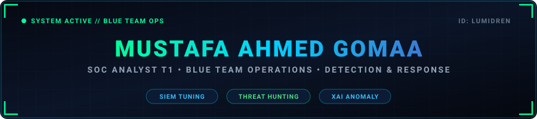

<!-- HEADER BANNER (SELF-HOSTED LOCAL SVG) -->
<p align="center">
  
</p>

<!-- DYNAMIC TYPING TERMINAL -->
<p align="center">
  <a href="https://github.com/lumidren">
    
  </a>
</p>

<!-- SOCIAL & CONTACT BADGES -->
<p align="center">
  <a href="https://www.linkedin.com/in/lumidren/" target="_blank">
    
  </a>
  <a href="https://tryhackme.com/p/MustafaGomaa" target="_blank">
    
  </a>
  <a href="mailto:mustafagomaa.edu@gmail.com">
    
  </a>
  <a href="https://github.com/lumidren">
    
  </a>
</p>

---

### 🛡️ Operational Overview & Bio

```text
[ANALYSIS MODE: ACTIVE]
┌───────────────────┬─────────────────────────────────────────────────────────────┐
│ Operator          │ Mustafa Ahmed Gomaa (Handle: lumidren)                      │
│ Focus Domain      │ SOC Operations, Threat Intelligence, Detection Engineering  │
│ Academics         │ B.Sc. in Cybersecurity & Networks @ EJUST (Grad: Jun 2027)  │
│ Production Exp    │ Live Enterprise Banking SOC Intern @ CIB Egypt              │
│ Status            │ Ready for Incident Response & Detection Engineering Triage  │
└───────────────────┴─────────────────────────────────────────────────────────────┘
```

> **SOC Analyst** with real-world enterprise experience from a live commercial banking SOC at **CIB Egypt**, where I investigated real production security alerts, correlated logs across enterprise SIEMs, and executed threat-hunting playbooks. 
> 
> Passionate about engineering automated defense systems, threat intelligence correlation, and Explainable AI (XAI) applied to behavioral network anomaly detection.

---

### ⚡ SOC Core Metrics & Achievements

<p align="center">
  
  
  
  
</p>

---

### 🔬 High-Impact Engineering Projects

<table>
<tr>
<td width="50%" valign="top">

### 🛰️ CIPHER — SOC Threat Intelligence Platform
*Full-Stack Threat Intelligence & Correlation Engine designed for Tier-1/2 SOC Analysts.*

- **Real-Time IOC Enrichment:** Integrated automated API enrichment via **VirusTotal** and **AbuseIPDB**.
- **STIX 2.1 Threat Sharing:** Native threat intelligence export conforming to cyber threat intelligence standards.
- **Interactive Graph Visualization:** Built interactive node-link attack maps using **D3.js** for adversary campaign tracking.
- **Cryptographic Security:** Secured all sensitive intelligence at rest with **Blowfish encryption**.
- **Dataset Replay:** Preloaded with real-world APT threat actor datasets to simulate operational SOC triage.
<br>
<sub><b>Stack:</b> Python, Flask, Vanilla JavaScript, D3.js, REST APIs, Blowfish</sub>

</td>
<td width="50%" valign="top">

### 🤖 GUARDIAN — Explainable IoT Anomaly Detection
*Undergraduate Thesis: Explainable Behavioral Identity for IoT Security Monitoring.*

- **Machine Learning Engine:** Unsupervised **Isolation Forest** modeling across **60 behavioral features** extracted per 10-second window.
- **Edge Architecture:** Engineered and profiled specifically for lightweight edge deployment on **Raspberry Pi 4**.
- **XAI & Natural Language Explanations:** Employs NLG to generate readable incident summaries for Tier-1 analysts rather than raw anomaly scores.
- **Automated Mitigation:** Implemented graduated enforcement tiers (throttling, VLAN quarantine, dynamic ACL isolation).
<br>
<sub><b>Stack:</b> Python, Scikit-Learn, Isolation Forest ML, Network Telemetry, Raspberry Pi 4</sub>

</td>
</tr>
<tr>
<td width="50%" valign="top">

### 🔐 Secure Cloud Portal — Zero-Dep Cryptography
*Cryptographically secure communication portal implemented entirely from scratch without third-party crypto libraries.*

- **Symmetric Stream Cipher:** Handcrafted implementation of the **ChaCha20** algorithm (quarter-round permutation, matrix state, keystream generation).
- **Asymmetric Cryptosystem:** Implemented **ElGamal** encryption over large prime fields for key exchange and authentication.
- **Protocol Integrity:** Hardened client-server architecture with custom message integrity validations and timing-attack considerations.
<br>
<sub><b>Stack:</b> Python, Number Theory, Mathematical Cryptography</sub>

</td>
<td width="50%" valign="top">

### 🎯 SOC Simulation & Threat Hunting Labs
*Enterprise threat hunting & incident triage across 50+ end-to-end simulated cyber attacks.*

- **Attack Scenarios Investigated:** Password spraying, brute force, spear-phishing payloads, lateral movement (Pass-the-Hash, PsExec), and DNS data exfiltration.
- **Detection Engineering:** Built custom SPL search queries in **Splunk** and tuned rules in **IBM QRadar** / **ELK Stack**.
- **Adversary Mapping:** Correlated multi-stage telemetry to specific **MITRE ATT&CK** Enterprise tactics, techniques, and procedures (TTPs).
<br>
<sub><b>Stack:</b> Splunk, IBM QRadar, ELK Stack, Wireshark, Snort IDS, MITRE ATT&CK</sub>

</td>
</tr>
</table>

---

### 🧰 Defensive Arsenal & Technical Matrix

<table>
  <tr>
    <th width="25%">Domain</th>
    <th width="75%">Technologies & Methodologies</th>
  </tr>
  <tr>
    <td><b>SIEM & Telemetry</b></td>
    <td>
      
      
      
      
      
    </td>
  </tr>
  <tr>
    <td><b>Security Operations</b></td>
    <td>
      <code>Alert Triage</code> <code>Incident Investigation</code> <code>Log Analysis</code> <code>Threat Hunting</code> 
      <code>Phishing Analysis</code> <code>IOC Extraction</code> <code>STIX 2.1</code> <code>Root Cause Analysis</code>
    </td>
  </tr>
  <tr>
    <td><b>Threat Frameworks</b></td>
    <td>
      
      
      
      
    </td>
  </tr>
  <tr>
    <td><b>Network Inspection & Tools</b></td>
    <td>
      
      
      
      
      
    </td>
  </tr>
  <tr>
    <td><b>Core Networking</b></td>
    <td>
      <code>TCP/IP</code> <code>VLSM Subnetting</code> <code>VLANs & 802.1Q</code> <code>NAT/PAT</code> <code>OSPF</code> <code>BGP</code> 
      <code>IPSec VPNs</code> <code>Dynamic ACLs</code> <code>AAA / RADIUS</code> <code>Next-Gen Firewalls</code>
    </td>
  </tr>
  <tr>
    <td><b>Programming & SecDev</b></td>
    <td>
      
      
      
      
      
    </td>
  </tr>
  <tr>
    <td><b>Systems & Infrastructure</b></td>
    <td>
      
      
      
      
      
    </td>
  </tr>
</table>

---

### 💼 Operational Work Experience

```markdown
├── [Jun 2026 – Jul 2026] CIB Egypt (Commercial International Bank)
│   └── Role: SOC Analyst Summer Intern (Enterprise Tier-1 Blue Team)
│       • Monitored live enterprise banking telemetry, triaged security alerts, and escalated incidents.
│       • Performed proactive threat hunting and deep-dive log analysis using enterprise SIEM architectures.
│       • Collaborated with senior incident responders on threat actor attribution and playbook execution.
│
└── [Aug 2026 – Present] Egypt-Japan University of Science & Technology (EJUST)
    └── Role: IT & Systems Intern
        • Maintained server administration, active directory policies, and secure networking equipment.
        • Architected a unified Campus Tour Navigation System and an AI-based Academic Advisor engine.
```

---

### 🎖️ Certifications, Accreditations & Training

<table>
  <tr>
    <th>Specialization</th>
    <th>Credentials & Authorities</th>
    <th>Year</th>
  </tr>
  <tr>
    <td><b>SIEM & Analytics</b></td>
    <td>
      • <b>Fortinet Certified Associate</b> — FortiSIEM<br>
      • <b>Fortinet Certified Associate</b> — FortiAnalyzer
    </td>
    <td>2026<br>2026</td>
  </tr>
  <tr>
    <td><b>SOC & Blue Team</b></td>
    <td>
      • <b>TryHackMe:</b> SOC Level 1 Path<br>
      • <b>TryHackMe:</b> Security Engineer Path<br>
      • <b>DEPI:</b> Vulnerability Analyst & Penetration Tester
    </td>
    <td>2026<br>2026<br>2025</td>
  </tr>
  <tr>
    <td><b>Cisco & Networking</b></td>
    <td>
      • <b>DEPI:</b> Cisco Cybersecurity Engineer — Infrastructure & Security<br>
      • <b>NTI:</b> Cisco CyberOps Associate<br>
      • <b>NTI:</b> Cisco CCNP ENCOR (Enterprise Core Network Technologies)<br>
      • <b>NTI:</b> Cisco CCNA (Routing & Switching)
    </td>
    <td>2025<br>2025<br>2025<br>2023</td>
  </tr>
  <tr>
    <td><b>Security Engineering</b></td>
    <td>
      • <b>Huawei (NTI):</b> HCIA Security<br>
      • <b>NTI:</b> Ethical Hacking & Offensive Defense<br>
      • <i>CompTIA Security+ (In preparation)</i>
    </td>
    <td>2025<br>2025<br>2026</td>
  </tr>
</table>

---

<p align="center">
  
  
</p>